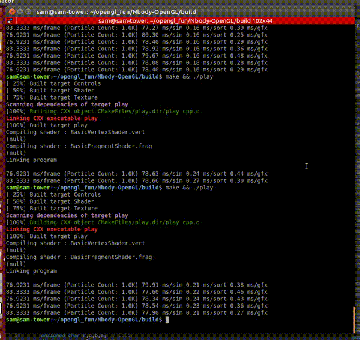
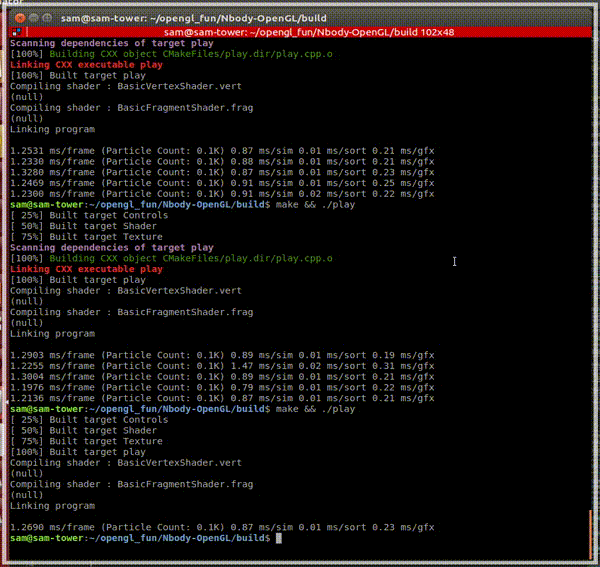

# Play
---

**WARNING MASTER BRANCH IS EXPERIMENTAL AND WILL PROBABLY BREAK**

This is a sandbox for practicing OpenGL using [GLFW](http://www.glfw.org).
Check the other branches for working examples

#### Octree decomposition

#### 1000 Particle NBody Sim

#### 100 Particle NBody Sim

Using extremely basic brute-force euler computation on the CPU as a starting benchmark.

Rough timing breakdown for 100,200,500,1000, 2000 and 5000 particles:

    Total ms per frame | (# Particles) | Simulation ms | Sorting ms | Graphics update ms

    1.5361 ms/frame (Particle Count: 0.1K) 0.87 ms/sim 0.01 ms/sort 0.21 ms/gfx
    3.5842 ms/frame (Particle Count: 0.2K) 3.16 ms/sim 0.03 ms/sort 0.22 ms/gfx
    20.0000 ms/frame (Particle Count: 0.5K) 19.08 ms/sim 0.10 ms/sort 0.19 ms/gfx
    76.9231 ms/frame (Particle Count: 1.0K) 76.64 ms/sim 0.25 ms/sort 0.68 ms/gfx
    333.3333 ms/frame (Particle Count: 2.0K) 316.54 ms/sim 0.69 ms/sort 0.48 ms/gfx
    1000.0000 ms/frame (Particle Count: 5.0K) 1922.07 ms/sim 1.57 ms/sort 0.63 ms/gfx

Following the tutorials at [opengl-tutorials](http://www.opengl-tutorial.org/beginners-tutorials/)

## Compiling

Use CMake to generate the makefile with properly linked libraries in `build/` (If it doesn't exist create it using `mkdir build/`)

Then cd into build and call `cmake ..` to generate the makefile

    mkdir build/
    cd build/
    cmake ..

## Building
Then, build the executable using `make`

## Running
    ./play

---
## Installing GLFW3 (on Linux)

Go to [GLFW](http://www.glfw.org) and download the source, then follow the [instructions to compile GLFW](http://www.glfw.org/docs/latest/compile.html) as a dynamic library.

    sudo apt-get install xorg-dev libglu1-mesa-dev freeglut3-dev libglew-dev libglm-dev

---
## Troubleshooting

Discovered through trial and error

#### Error opening libglfw shared library

    error while loading shared libraries: libglfw.so.3: cannot open shared object file: No such file or directory

Try running `sudo ldconfig`. Also make sure when you compiled and built glfw that you enabled SHARED_LIB in cmake (via gui or curses)

#### Missing glm error

    fatal error: glm/glm.hpp: No such file or directory
     #include <glm/glm.hpp>
                           ^
Install GLM `sudo apt-get install libglm-dev`

#### Missing glew error

    fatal error: GL/glew.h: No such file or directory
    #include <GL/glew.h>
                        ^

Install glew `sudo apt-get install libglew-dev`

#### Random undefined references to 'X<something>'
I added several links in CMakeLists.txt `set(GL_LIBRARY GL GLU X11 Xi Xrandr Xcursor Xxf86vm pthread Xinerama Xft)`
