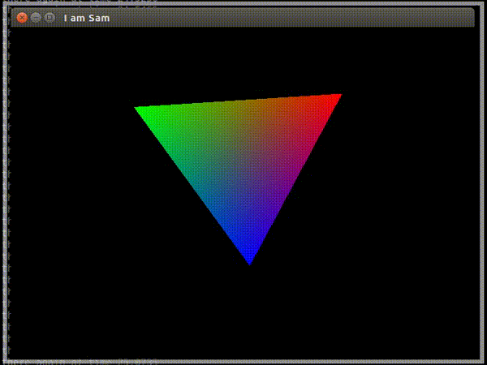

# Play
---
This is a sandbox for practicing OpenGL using [GLFW](http://www.glfw.org)

This branch has a basic spinning triangle example using OpenGL and GLFW

## Compiling

Use CMake to generate the makefile with properly linked libraries in `build/` (If it doesn't exist create it using `mkdir build/`)

Then cd into build and call `cmake ..` to generate the makefile

    mkdir build/
    cd build/
    cmake ..

## Building
Then, build the executable using `make`

## Running
    ./play

---
## Installing GLFW3 (on Linux)

Go to [GLFW](http://www.glfw.org) and download the source, then follow the [instructions to compile GLFW](http://www.glfw.org/docs/latest/compile.html) as a dynamic library.

    sudo apt-get install xorg-dev libglu1-mesa-dev freeglut3-dev 

---
## Troubleshooting

#### Error opening libglfw shared library

    error while loading shared libraries: libglfw.so.3: cannot open shared object file: No such file or directory

Try running `sudo ldconfig`. Also make sure when you compiled and built glfw that you enabled SHARED_LIB in cmake (via gui or curses)
